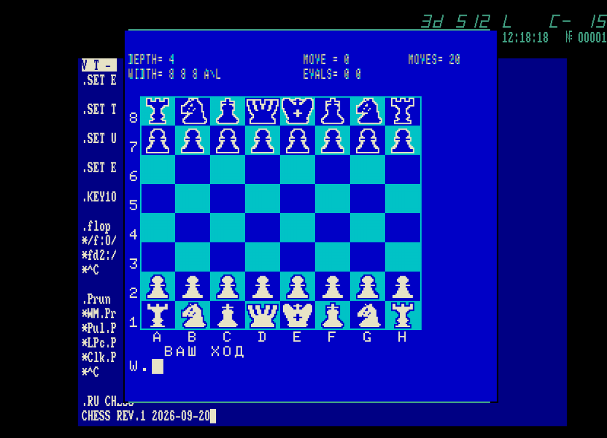

# neon-chess

Порт шахматной программы `CHESS` с БК-0010 на Союз-Неон ПК 11/16.




## Идея проекта

Оригинальная программа CHESS написана для БК-0010 и использует его EMT-запросы
к монитору (клавиатура, вывод символов/строк, курсор). Порт запускает
дизассемблированный/восстановленный код игры (`CHESS.MAC`) как есть, а все
обращения к БК-0010 эмулируются на стороне Союз-Неон:

- `MAIN.MAC` — загрузчик: создаёт видео-область через `ARCRE`/`VWCRE`/`PLCRE`,
  устанавливает свой обработчик EMT (`EMTEMU`) и передаёт управление в код игры.
- `BKEMUL.MAC` — эмуляция части драйвер-мониторного модуля БК-0010 (вывод символов, строк, курсор, клавиатура и т.д.), необходимой игре.
- `CHESS.MAC` — сама игра: полностью выверенный побайтно дизассемблированный
  код оригинального `CHESS.BIN` для БК-0010, с последующими небольшими измененими.


## Текущее состояние

Игра запускается, показывает страницы инструкции, рисует доску и принимает
ходы. Команды `PW`/`PB` включают режим "компьютер играет за белых/чёрных" —
работает полный режим "компьютер против компьютера".

Не сделано:
 - выход из программы
 - мелодии


## Сборка

```
!compilelink.bat
```

Собирает `MAIN.MAC` через MACRO-11/LINK (RT-11) в `CHESS.SAV`.
Используется "эмулятор RT-11" от Patron.


## Запуск

```
!runneonbtl.bat
```

Кладёт `CHESS.SAV` на образ диска и запускает эмулятор NeonBTL.
